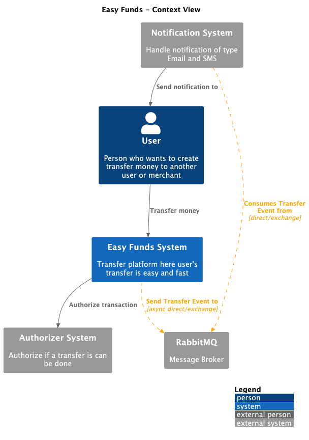
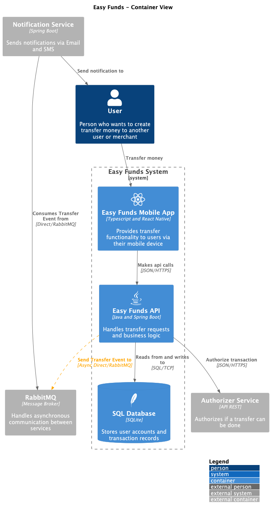
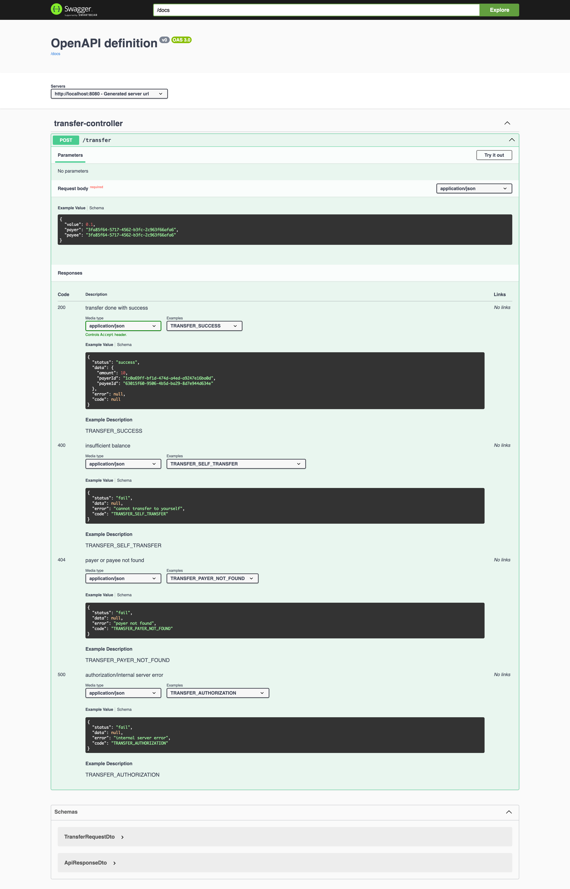

# Easy Funds

Application to handle transfers money between user and user/merchant and publish Events into RabbitMQ.

## Architecture

All files are located at `@docs` folder.

Context



Container



### Swagger

When project is running, available at `http://localhost:8080/swagger-ui.html`



## Running the project

```shell
$ mvn clean package
$ docker compose up --build
```

## Running Unit Tests

```shell
$ mvn test
```

## Endpoints

You can do a manual test running `/client/transfer.http` file.

Transfer

```http request
POST http://localhost:8080/transfer
Content-Type: application/json

{
    "value": 10,
    "payer": "1c0a69ff-bf1d-474d-a4ed-a9247e16ba0d",
    "payee": "cfcb249c-62c5-41a2-9078-cb210f8c70a2"
}
```

## RabbitMQ

To see Exchange, Queue and Messages, while the project is running open `http://localhost:15672`
and insert Username: `root` and Password: `root`.

## TODO

- Integration tests
- Observability such as Sentry and Elastic
- Authentication
